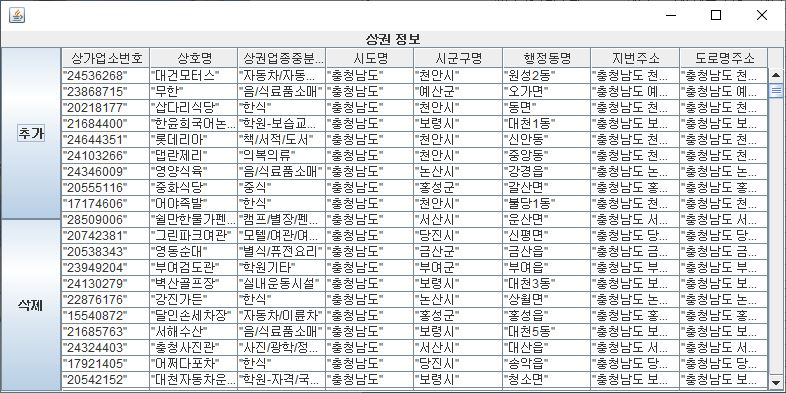
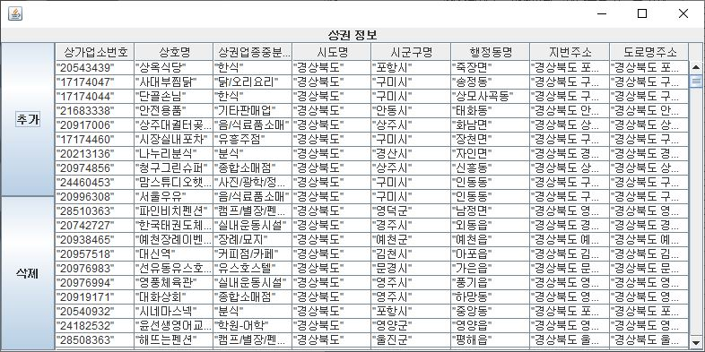
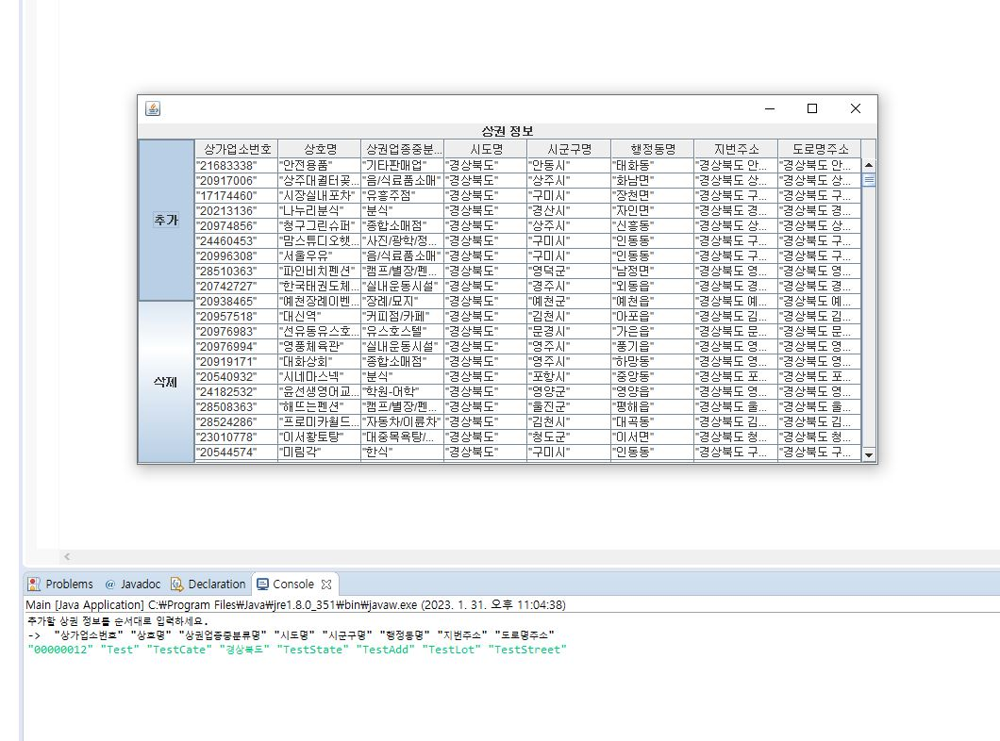
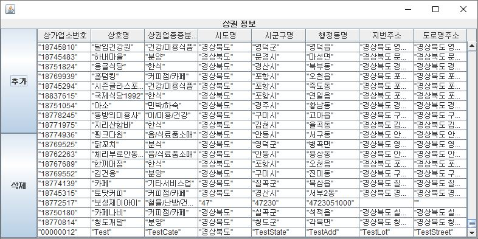
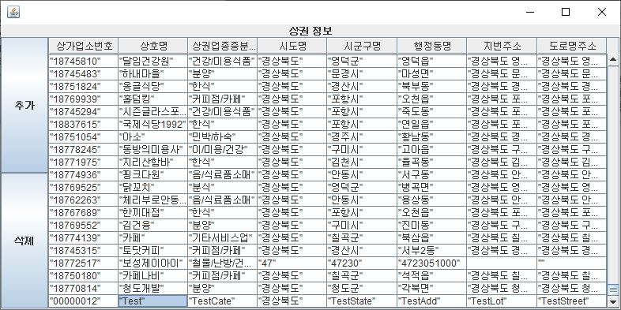
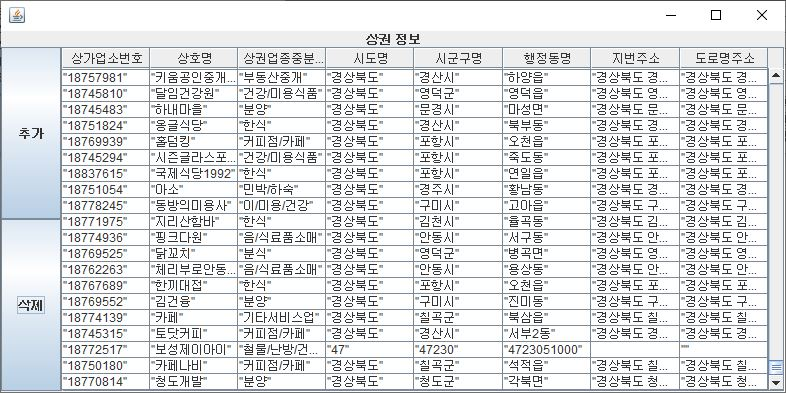

# 1) 기본
## 시작화면

## '공원'검색

# 2) 추가
## 경기도 관광지 누르고 지역축제정보 버튼 클릭

## 전남 관광지 누르고 지역축제정보 버튼 클릭

# 3) 심화
## 충남 관광지 누르고 상권정보 버튼 클릭

## 경북 관광지 누르고 상권정보 버튼 클릭

## [상권정보 추가] 추가 클릭시 콘솔에 입력 받음

## [상권정보 추가] 입력시 테이블 아래에서 확인

## [상권정보 삭제] 테이블에서 삭제할 데이터 클릭 

## [상권정보 삭제] 삭제 버튼 클릭시 테이블에서 사라짐 확인

